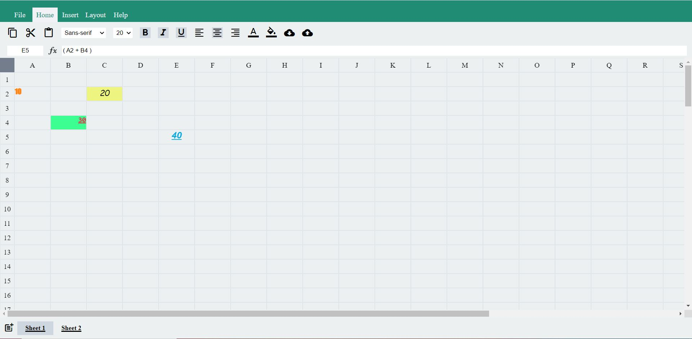
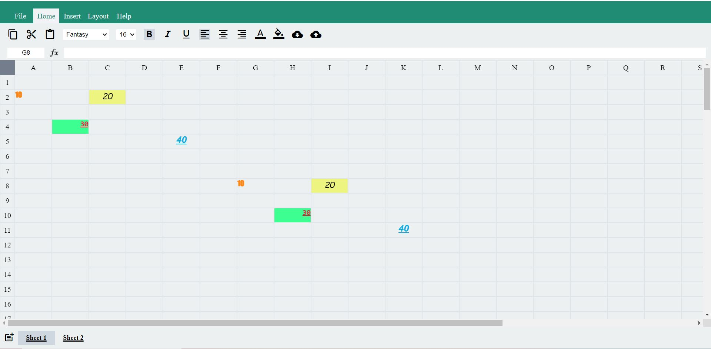

# Excel-Clone

## Description
### Build a Excel Clone with features :- 
- Properties Like Bold, Italic, underLine, TextColor, BGColor, etc
can be applied to each cell (Two-Way Binding).
- Cyclic Path Can Be Traced using certain colors.
- Multiple Sheet Can be added as well as Removed.
- Can Cut, Copy & Paste Values in a range of cells.
- Can Download as well as upload sheets. 

## See Live Demo

### visit --> https://master--jocular-duckanoo-dd682a.netlify.app/

## Screenshots

## Technologies Stack:

- HTML
- CSS
- Javascript
